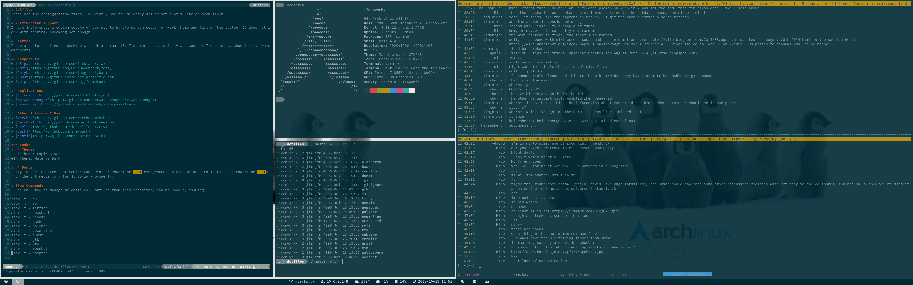

# Dotfiles
These are the configuration files I currently use for my daily driver setup of i3 etc on Arch linux.

# Multimonitor support
I have implemented a custom couple of scripts to handle screen setup for work, home and just on the laptop. It does not work with docking/undocking yet though

# Desktop
I use a custom configured desktop without a normal DE. I prefer the simplicity and control I can get by choosing my own components

## Screenshot

## Components
* [i3-gaps](https://github.com/Airblader/i3)
* [Rofi](https://github.com/DaveDavenport/rofi)
* [Polybar](https://github.com/jaagr/polybar)
* [Dunst](https://github.com/dunst-project/dunst)
* [Compton](https://github.com/chjj/compton)

## Applications
* [Nitrogen](https://github.com/l3ib/nitrogen)
* [NetworkManager](https://github.com/NetworkManager/NetworkManager)
* [pasystray](https://github.com/christophgysin/pasystray)

## Other Software I Use
* [WeeChat](https://github.com/weechat/weechat)
* [NewsBoat](https://github.com/newsboat/newsboat)
* [RTV](https://github.com/michael-lazar/rtv)
* [Bark](https://github.com/jfm/bark)
* [NeoVim](https://github.com/neovim/neovim)

### Looks
#### Themes
Icon Theme: Papirus Dark
GTK Theme: Materia Dark

#### Fonts
I try to use the excellent Source Code Pro for Powerline font everywhere. On Arch we need to install the Powerline fonts from the git repository for it to work properly.

# Stow Commands
I use Gnu Stow to manage my dotfiles. Dotfiles from this repository can be used by issuing:
~~~
stow -t ~ i3
stow -t ~ rofi
stow -t ~ termite
stow -t ~ newsboat
stow -t ~ neovim
stow -t ~ bash
stow -t ~ polybar
stow -t ~ powerline
stow -t ~ dunst
stow -t ~ gtk
stow -t ~ rtv
stow -t ~ weechat
stow -t ~ compton
~~~
